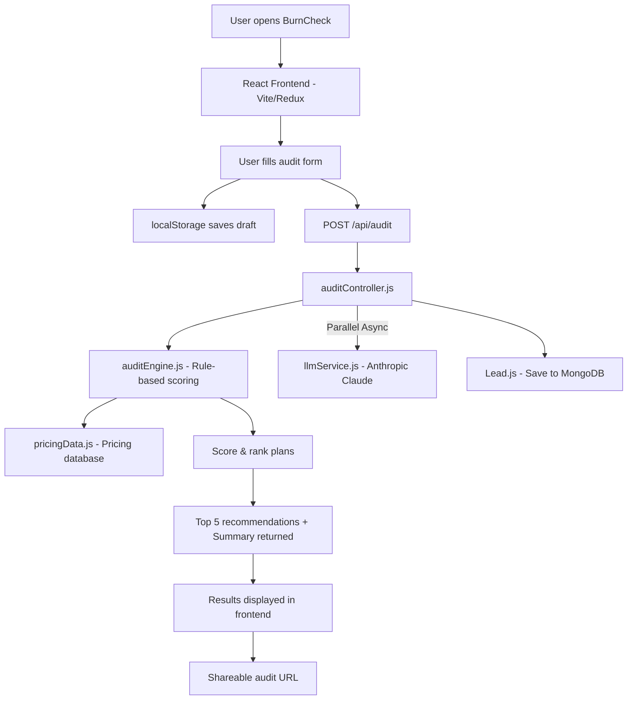

# Architecture

## System Diagram



## Folder Structure

```
burncheck/
├── backend/
│   ├── server.js                    # Entry point — connects DB, starts Express
│   └── src/
│       ├── app.js                   # Express app setup, middleware, routes
│       ├── config/
│       │   ├── config.js            # Env var validation (PORT, MONGO_URI)
│       │   └── database.js          # Mongoose connection logic
│       ├── controllers/
│       │   └── auditController.js   # Handles POST /api/audit — runs engine, saves lead
│       ├── data/
│       │   └── pricingData.js       # All tool pricing — verified against official pages
│       ├── models/
│       │   └── Lead.js              # Mongoose schema — stores user input + recommendations
│       ├── routes/
│       │   └── auditRoutes.js       # Route definitions — POST /api/audit
│       └── services/
│           └── auditEngine.js       # Core logic — scoring algorithm, plan recommendations
│
└── frontend/
    ├── index.html
    ├── vite.config.js
    └── src/
        ├── api/
        │   └── auditApi.js          # Layer 4 - Axios interceptors and endpoints
        ├── hooks/
        │   └── useAudit.js          # Layer 3 - Custom hooks abstracting state
        ├── store/
        │   ├── store.js             # Layer 2 - Redux store configuration
        │   └── slices/              # Redux slices (auditSlice)
        ├── components/
        │   └── layout/              # Reusable layout UI components
        ├── pages/                   # Layer 1 - Page level UI components
        ├── theme/                   # Stitch Design System tokens
        ├── main.jsx                 # React entry point
        ├── App.jsx                  # React Router setup
        └── index.css                # Global styles
```
```

## Data Flow

Step-by-step: how a user's input becomes an audit result.

1. **User opens the app** → React frontend loads via Vite dev server (port 5173).
2. **User fills the audit form** → fields include team size, primary use case, monthly budget, and whether they need API access. Form state is saved to `localStorage` on every change so nothing is lost on refresh.
3. **User submits the form** → frontend sends `POST /api/audit` to the Express backend (port 3000).
4. **`auditController.js` receives the request** → extracts `teamSize`, `useCase`, `monthlyBudget`, `needsAPI` from the request body.
5. **`auditEngine.js` runs the scoring algorithm:**
   - Iterates through every tool and plan in `pricingData.js`
   - Calculates the actual monthly cost (handles per-seat vs flat-rate pricing)
   - Filters out plans that exceed the user's budget
   - Scores each plan using `scorePlan()` — bonus points for team-size fit, API needs, free tiers
   - Sorts by score descending, returns top 5
6. **Lead is saved to MongoDB** → the user's input + recommendations are stored as a `Lead` document for analytics and follow-up.
7. **Response sent to frontend** → JSON with `{ success: true, recommendations: [...] }`.
8. **Results rendered** → frontend displays the top 5 plans with tool name, plan name, monthly cost, and why it fits.

## Stack Choices — Why These Tools

| Layer      | Choice                    | Why                                                                |
| ---------- | ------------------------- | ------------------------------------------------------------------ |
| Frontend   | React + Vite              | Fast HMR, simple SPA — no SSR needed since backend handles data    |
| Backend    | Express.js                | Minimal, well-documented, easy to add middleware and routes        |
| Database   | MongoDB + Mongoose        | Schema-flexible for evolving pricing data structures               |
| Deployment | Vercel (FE) + Render (BE) | Free tiers, GitHub integration, zero-config for Node apps          |
| Styling    | Vanilla CSS               | Full control, no build-step dependency on Tailwind/utility classes |

## If We Had to Handle 10,000 Audits/Day

The current architecture handles ~100 audits/day comfortably. To scale to 10,000+:

1. **Add Redis caching** — Pricing data changes weekly, not per-request. Cache `pricingData.js` in Redis with a 24-hour TTL instead of reading from the JS module every time.
2. **Connection pooling** — MongoDB Atlas supports connection pooling out of the box. Set `maxPoolSize: 50` in the Mongoose connection options to handle concurrent audit writes.
3. **Rate limiting** — Add `express-rate-limit` middleware to prevent abuse. Cap at 10 audits per IP per minute.
4. **Queue heavy operations** — If we add LLM-generated summaries (Anthropic API), those calls should go through a job queue (BullMQ + Redis) rather than blocking the HTTP response. Return the audit result immediately, send the AI summary via email async.
5. **CDN for frontend** — Vercel already serves static assets via their edge network. No changes needed on the frontend side.
6. **Horizontal scaling** — Deploy multiple backend instances behind a load balancer on Render or Railway. The Express app is stateless (no sessions), so any instance can handle any request.
