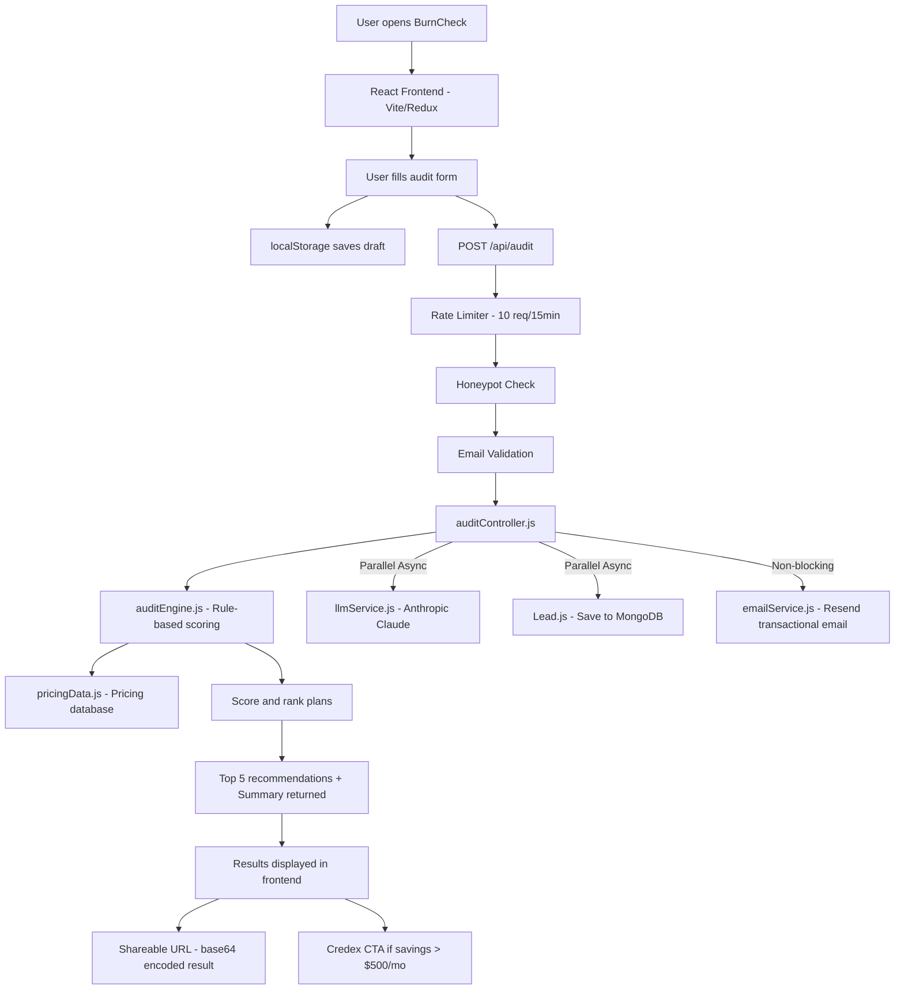

# Architecture

## System Diagram



## Folder Structure

```
burncheck/
├── backend/
│   ├── server.js                    # Entry point — connects DB, starts Express
│   └── src/
│       ├── app.js                   # Express app, CORS, rate limiting, routes
│       ├── config/
│       │   ├── config.js            # Env var validation (PORT, MONGO_URI)
│       │   └── database.js          # Mongoose connection logic
│       ├── controllers/
│       │   └── auditController.js   # Handles POST /api/audit — engine + email + DB
│       ├── data/
│       │   └── pricingData.js       # All tool pricing — verified against official pages
│       ├── middleware/
│       │   ├── validateEmail.js     # express-validator email format check
│       │   └── honeypot.js          # Bot detection via hidden _hp field
│       ├── models/
│       │   └── Lead.js              # Mongoose schema — stores user input + recommendations
│       ├── routes/
│       │   └── auditRoutes.js       # POST /api/audit (honeypot → email → audit)
│       └── services/
│           ├── auditEngine.js       # Core logic — scoring algorithm, overlap detection
│           ├── llmService.js        # Anthropic Claude summary generation + fallback
│           └── emailService.js      # Resend transactional email — audit confirmation
│
└── frontend/
    ├── index.html                   # SEO meta + Open Graph + Twitter Card tags
    ├── vite.config.js
    └── src/
        ├── api/
        │   └── auditApi.js          # Layer 4 - Axios instance + API endpoints
        ├── hooks/
        │   └── useAudit.js          # Layer 3 - Custom hook abstracting Redux state
        ├── store/
        │   ├── store.js             # Layer 2 - Redux store configuration
        │   └── slices/              # Redux slices (auditSlice)
        ├── components/
        │   └── layout/              # TopNavBar, AppLayout
        ├── pages/
        │   ├── Home.jsx             # Audit form with localStorage draft + honeypot field
        │   └── Results.jsx          # Results page — savings hero, Credex CTA, share URL
        ├── main.jsx                 # React entry point
        ├── App.jsx                  # React Router setup (Home + Results only)
        └── index.css                # Global styles + CSS design tokens
```

## Data Flow

Step-by-step: how a user's input becomes an audit result.

1. **User opens the app** → React frontend loads via Vite (port 5173). Open Graph meta tags in `index.html` enable rich link previews on Twitter/Slack/LinkedIn.
2. **User fills the audit form** → fields: email, name, company, team size, use case, monthly budget, API need toggle, current tools chip selector. Form state saves to `localStorage` on every keystroke — no data lost on refresh.
3. **User submits the form** → frontend sends `POST /api/audit` to the Express backend (port 3000). A hidden `_hp` honeypot field is included — bots fill it, humans don't.
4. **Rate limiter checks** → `express-rate-limit` allows max 10 requests per IP per 15 minutes. Abuse protection without requiring auth.
5. **Honeypot middleware** → if `_hp` is non-empty, the request is silently rejected with a fake success response. Bots never know they were caught.
6. **Email validated** → `express-validator` checks format. Invalid emails return 400 immediately.
7. **`auditController.js` runs the pipeline:**
   - Calls `auditEngine.recommendPlan()` → top 5 scored recommendations
   - In parallel: calls `llmService.generateAuditSummary()` + saves `Lead` to MongoDB
   - After response is sent: fires `emailService.sendAuditEmail()` non-blocking
8. **`auditEngine.js` scoring algorithm:**
   - Iterates every tool and plan in `pricingData.js`
   - Calculates actual monthly cost (per-seat × teamSize OR flat-rate)
   - Hard filters plans exceeding budget
   - Scores each plan: use-case fit (+25), team-size fit (+20), API needs (+20), free tier (+8), budget efficiency (+5–10), overlap penalty (−15), already-paying penalty (−30)
   - Returns top 5 sorted by score, ties broken by lowest cost
9. **Response returned** → `{ success, recommendations, summary }` — summary is Claude-generated or rule-based fallback.
10. **Results rendered** → frontend shows: total savings hero (monthly + annual), Credex CTA if savings > $500/mo, AI analysis, top 5 plan cards with reasons and "View Plan" links.
11. **Shareable URL** → audit result encoded as base64 JSON in URL query param. No backend required, no PII in URL.
12. **Transactional email sent** → Resend delivers an HTML email to the user with their savings summary and Credex consultation CTA for high-savings cases.

## Stack Choices — Why These Tools

| Layer      | Choice                    | Why                                                                |
| ---------- | ------------------------- | ------------------------------------------------------------------ |
| Frontend   | React + Vite              | Fast HMR, simple SPA — no SSR needed since backend handles data    |
| State      | Redux Toolkit             | Predictable state for async audit flow; devtools for debugging     |
| Backend    | Express.js                | Minimal, well-documented, easy to add middleware and routes        |
| Database   | MongoDB + Mongoose        | Schema-flexible for evolving pricing data structures               |
| Email      | Resend                    | Simple REST API, generous free tier (3k/mo), great deliverability  |
| Abuse      | Rate limit + Honeypot     | Two-layer protection without requiring user auth or CAPTCHA        |
| Styling    | Vanilla CSS               | Full control, no build-step dependency on Tailwind/utility classes |
| Deployment | Vercel (FE) + Render (BE) | Free tiers, GitHub integration, zero-config for Node apps          |

## If We Had to Handle 10,000 Audits/Day

The current architecture handles ~100 audits/day comfortably. To scale to 10,000+:

1. **Redis caching** — Pricing data changes weekly. Cache `pricingData.js` in Redis with a 24-hour TTL instead of loading from JS module per request.
2. **Connection pooling** — MongoDB Atlas supports connection pooling. Set `maxPoolSize: 50` in Mongoose connection options to handle concurrent audit writes.
3. **Stricter rate limiting** — Current limit is 10/15min per IP. At scale, move to Redis-backed rate limiting (so limits persist across multiple backend instances).
4. **Queue LLM calls** — Anthropic API calls should go through BullMQ + Redis job queue rather than blocking the HTTP response. Return audit result immediately, send AI summary via email async (already partially done — email is non-blocking).
5. **CDN for frontend** — Vercel already serves static assets via edge network. OG images should be generated server-side with `@vercel/og` for dynamic per-audit previews.
6. **Horizontal scaling** — Deploy multiple backend instances behind a load balancer on Render or Railway. The Express app is fully stateless (no sessions), so any instance can handle any request.
